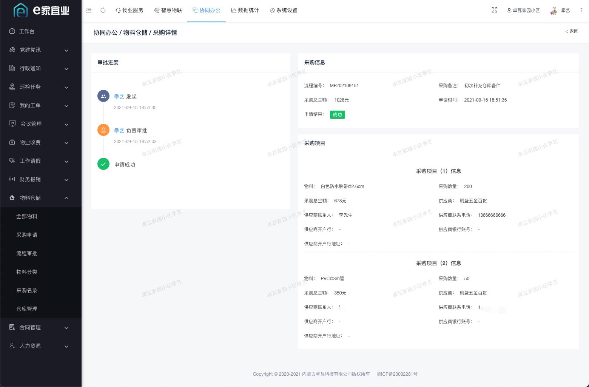
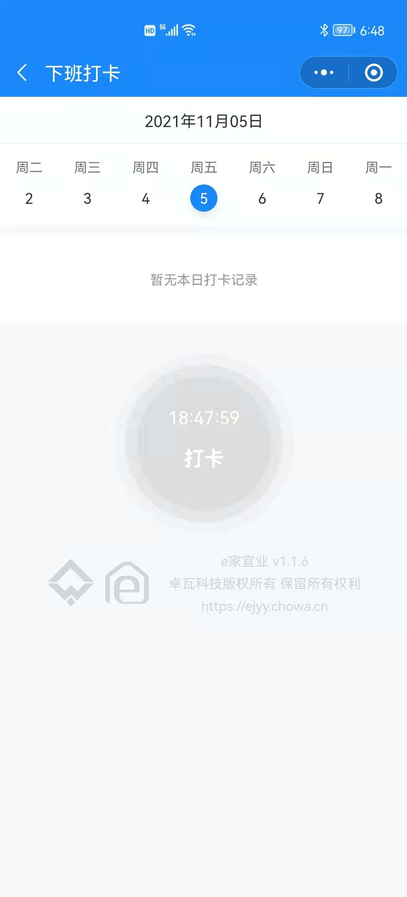

## 项目介绍

「e家宜业」是一整套基于AGPL开源协议开源的智慧物业解决方案。实现了微信公众号、小程序、PC、H5、智能硬件多端打通，旨在提升物业公司效率、规范物业服务流程、提升物业服务满意度、加强小区智慧化建设、便捷业主服务。 后端采用Koa + Typescript轻量级构建，支持分布式部署；前端使用vue + view-design开发。

## 严重声明

- 「e家宜业」已获得《软件著作权登记证书》，全部知识产权归卓瓦科技所有。
- 未经卓瓦科技授权，本产品及衍生产品不得用于任何形式的商业用途！！
- 禁止将本项目的代码和资源进行任何形式的出售和盈利，产生的一切后果由侵权者自负！！对违约者我们将保留诉诸法律的权利！！
- 转载本文请保留「e家宜业」相关名称和版权信息，并标明出处！！禁止将本文中涉及到的示例图片修改后传播！！坚决抵制各种未声明产品名称，赚流量、博眼球的行为！！

## 产品展示

### web中台

### 业主端小程序

### 员工端小程序

## 技术亮点

- 自主独立研发，无阉割、无加密、真正的开源
- web中台页面采用view-design开发，清爽易用
- 轻量级开发方案，借助node.js的高io、异步、cluster等特性
- 完善的权限管理，精细到每一个菜单
- 对接公众号和小程序，数据打通
- 精细的ui界面和流畅的交互动画
- 前后端分离，二次开发方便
- 支持定时任务和长连接
- 可对接小区硬件设备

## 系统体验

微信扫描下方这个紧挨着的二维码，关注官方公众号后，输入“e家宜业”获取体体验方式。

## 如何部署

### 服务器环境推荐要求

- Nginx
- Node.js 12.1.0
- MySQL  5.7
- Redis

### 部署文档

> 认真仔细看文档，会少走很多弯路

- [部署前的准备](docs/README.MD)
- [服务端部署](api-server/README.MD)
- [web中台部署](console-web/README.MD)
- [业主端小程序](owner-mp/README.MD)
- [员工端小程序](property-mp/README.MD)
- [公众号模板消息](docs/oa.MD)
- [短信消息模板](docs/sms.MD)
- [小区硬件接入](docs/iot.MD)

## 参与开发

[欢迎反馈问题](https://github.com/chowa/ejyy/issues)
[欢迎提交代码](https://github.com/chowa/ejyy/pulls)

## Java版开源地址
* https://gitee.com/iotkit-open-source/jejyy

**温馨提示：谨防上当受骗！不要相信非官方人员、淘宝商铺和代码贩子！！！**

## License

