<h1 align="center">🔥🔥🔥「e家宜业」智慧物业平台</h1>

    
    <b>无加密，无阉割，喜欢的话就点右上角 "Star" 支持一下吧，每一个"Star"，都是我们持续更新的动力！</b>  

## 项目介绍

「e家宜业」是一整套基于AGPL开源协议开源的智慧物业解决方案。实现了微信公众号、小程序、PC、H5、智能硬件多端打通，旨在提升物业公司效率、规范物业服务流程、提升物业服务满意度、加强小区智慧化建设、便捷业主服务。 后端采用Koa + Typescript轻量级构建，支持分布式部署；前端使用vue + view-design开发。

产品在设计和开发阶段，大量参考了北方的物业管理和工作模式，忽略了南方的情况，目前我们也正在收集和整理需求，后续会陆续对功能完善升级。

特别声明，我们没有也不会提供java后端版本。

官网地址：<https://ejyy.chowa.cn>

## 产品展示

特别说明一下，文档里的示例图片和演示环境的功能，这套代码部署完是一模一样的！没有阉割！更没有加密！

### web中台

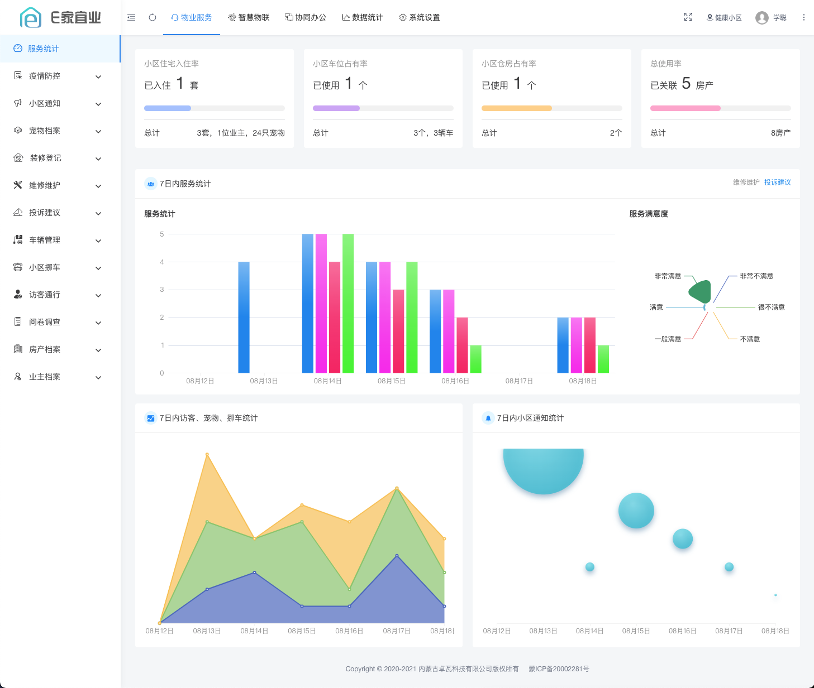
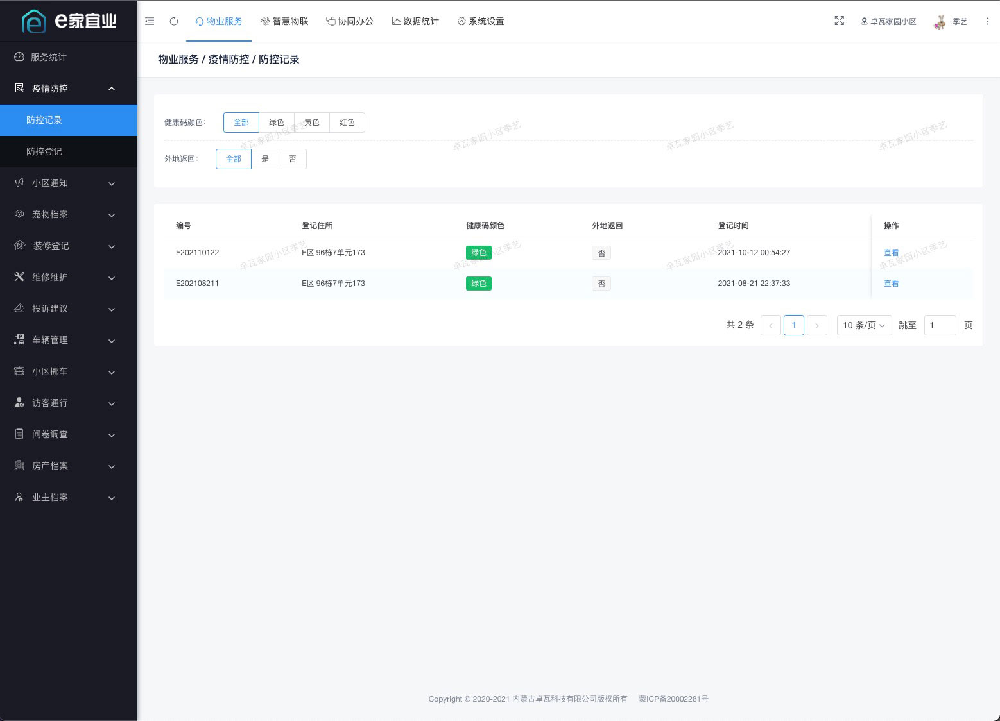
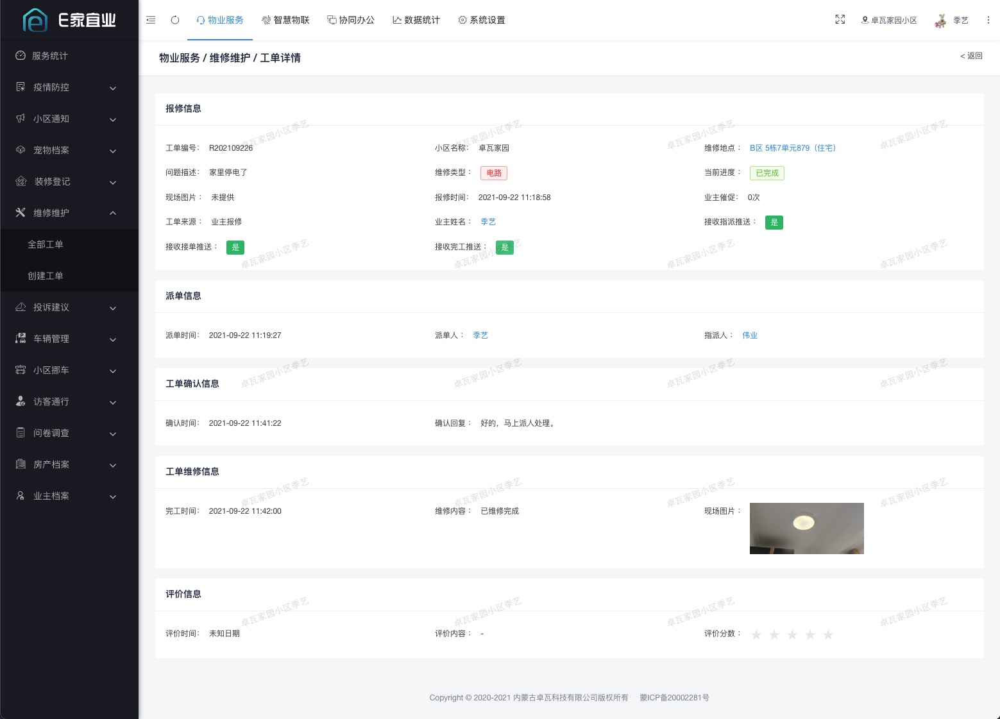

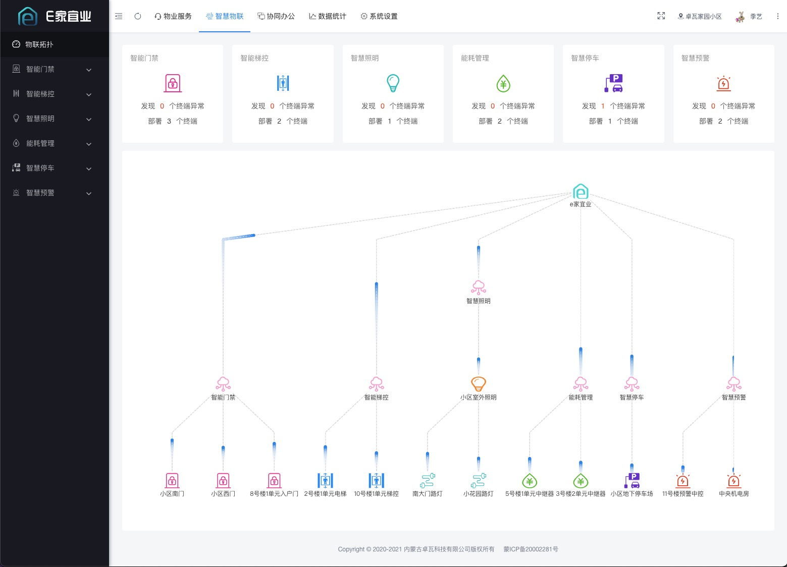
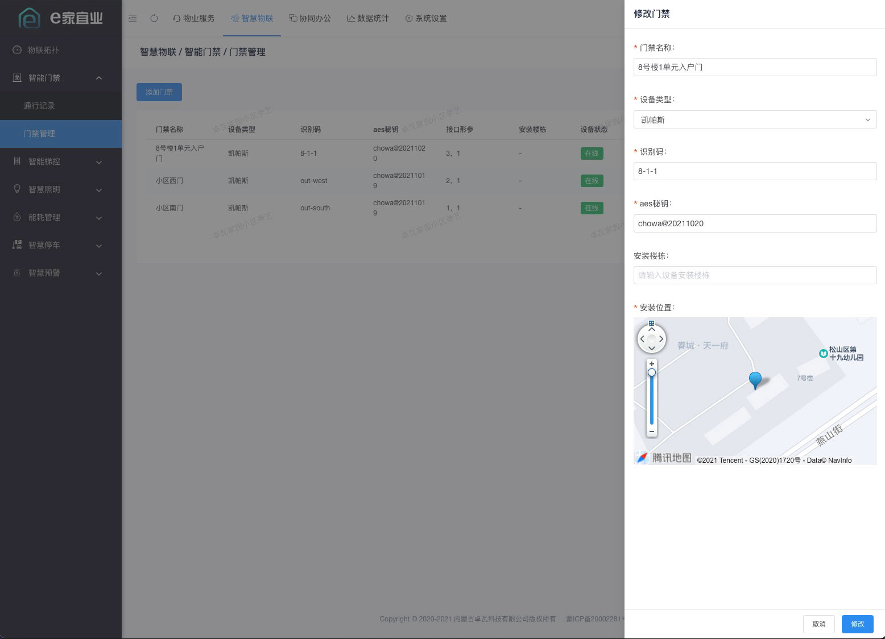
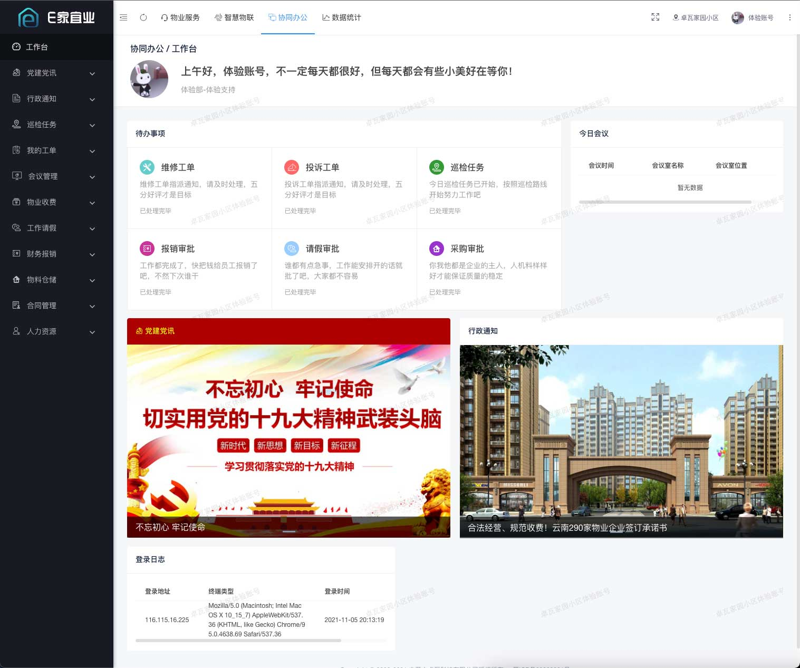
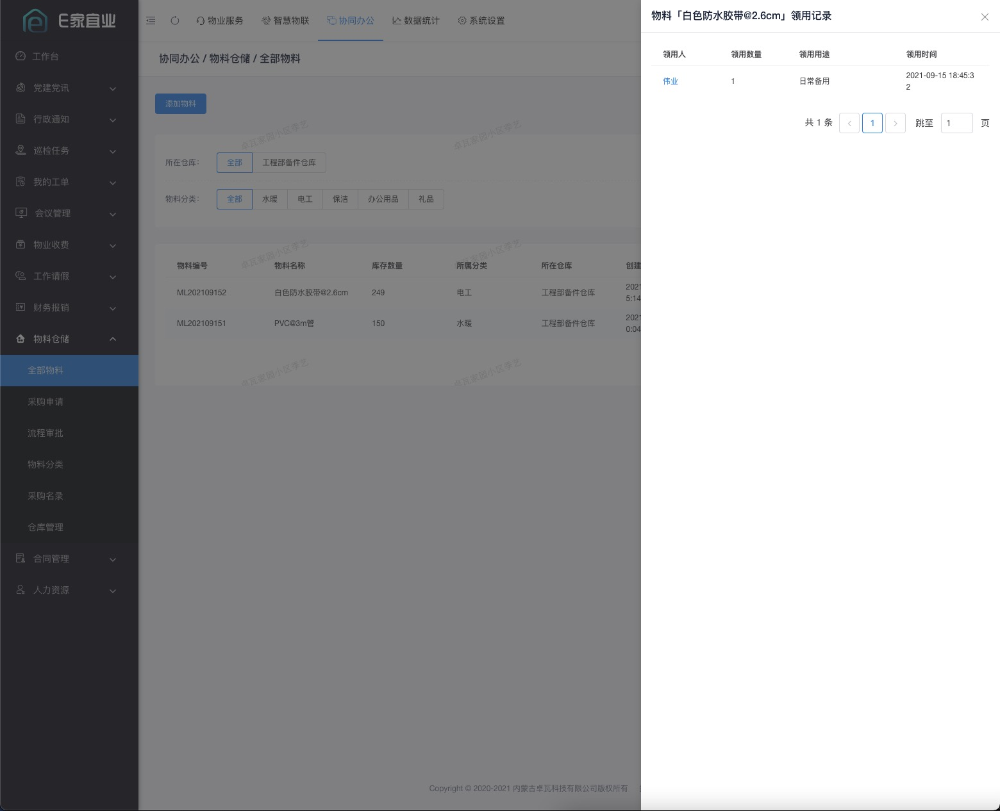
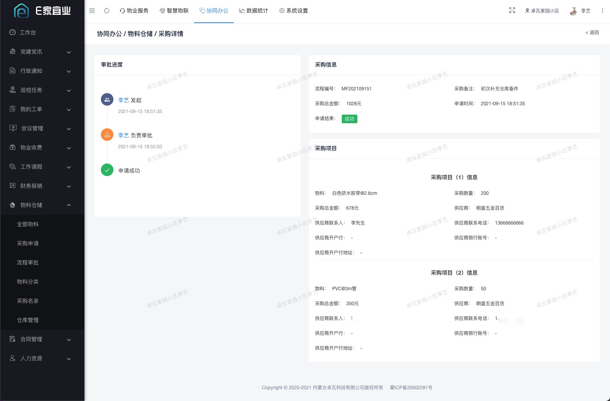
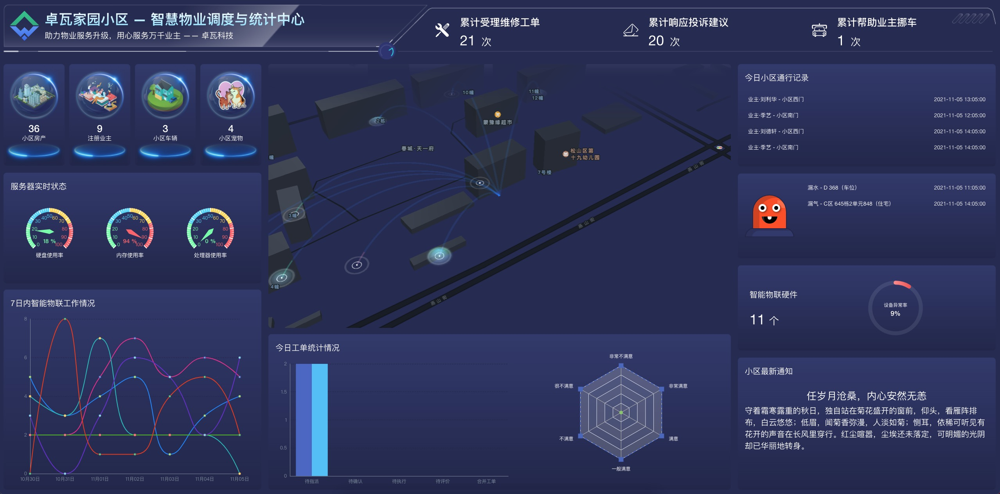

### 业主端小程序

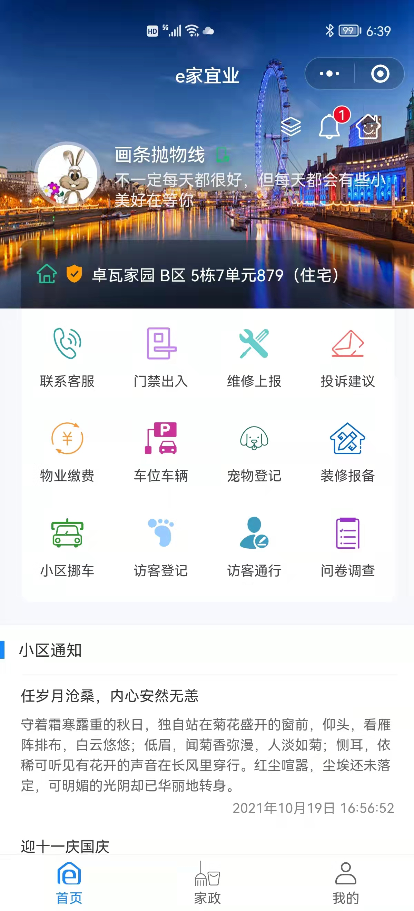

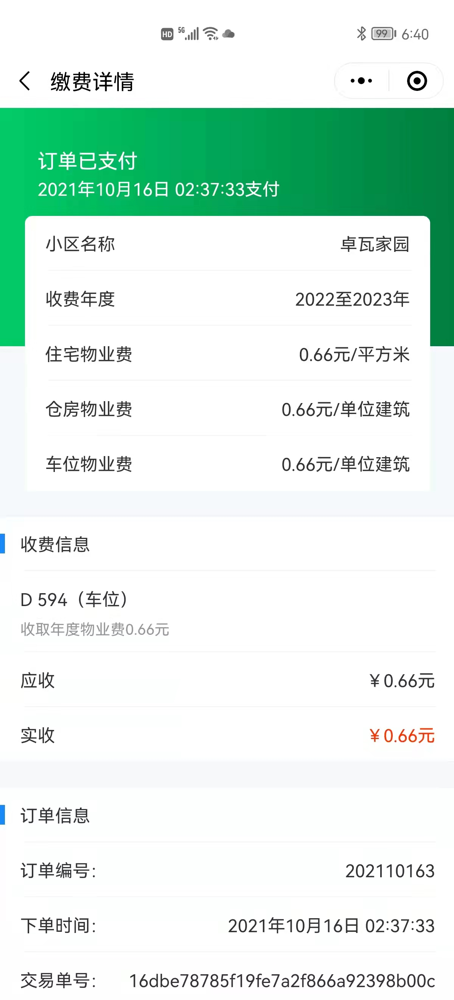
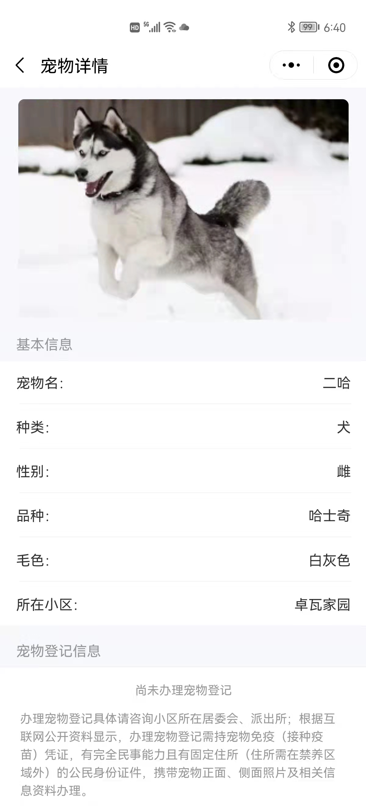
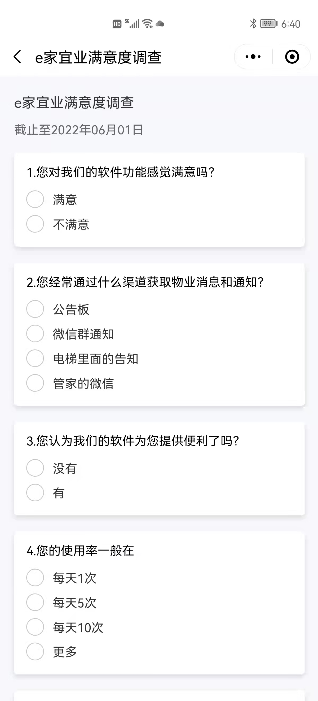

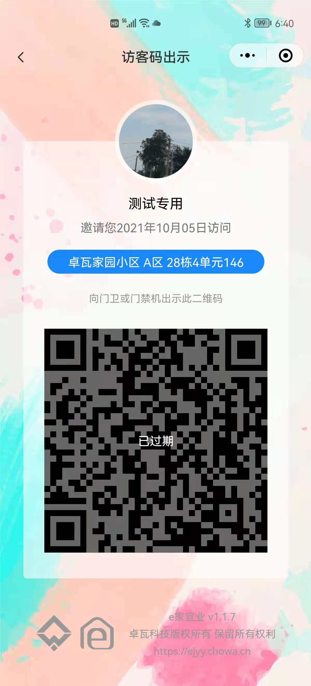
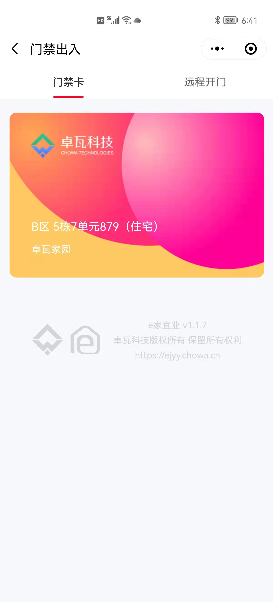

### 员工端小程序

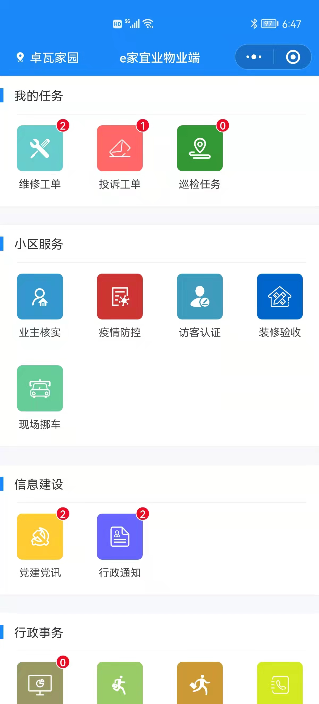
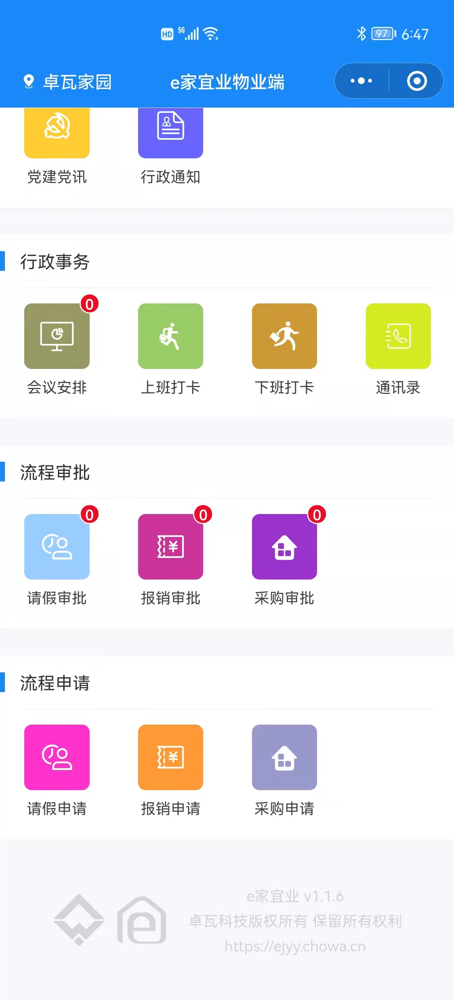

## 技术亮点

- 自主独立研发，无阉割、无加密、真正的开源
- web中台页面采用view-design开发，清爽易用
- 轻量级开发方案，借助node.js高io、异步、cluster等特性
- 完善的权限管理，精细到每一个菜单
- 对接公众号和小程序，数据打通
- 精细的ui界面和流畅的交互动画
- 前后分离，二次开发方便
- 支持定时任务和长连接
- 可对接小区硬件设备

## 功能上存在的不足

- 物联网硬件支持的比较少，这个问题主要是我接触到的厂商和小区硬件比较少
- 没考虑到外来车辆（访客车辆的情况）收费和小区有收费停车场的问题
- 物业费只能按年收
- 不支持向物业缴纳水电费等

## 使用手册

- [web中台使用手册](resource/manual_web.pdf)
- [业主小程序使用手册](resource/manual_ower.pdf)
- [物业员工小程序使用手册](resource/manual_employee.pdf)

## 系统演示

### web中台

> 演示版为saas多物业公司版本，小区开通上略有差异，其余无任何区别

<https://pc.ejyy.chowa.cn>

微信扫描下方这个紧挨着的二维码，关注公众号后，输入“e家宜业”获取体验账号和密码（之前把帐号密码写在文档里，有很多坏小子老搞破坏，才出此下策；这个公众号不会有垃圾推送的，请放心）。

如果你想有一个自己的账号体验系统、给别人演示，登录后可以在【协同办公】->【人力资源】-> 【员工入职】中自己开通一个，开通后，你就可以通过自己的微信扫码登录中台了~也可以用自己的微信访问【物业员工小程序】了。

| :warning: 注意                |
| --------------------------- |
| 该环境仅用来体验，我们会定时清理、重置数据！    |
| 请勿修改体验账号的密码！  |
| 不要在体验环境中发垃圾信息！尤其是一串随意敲打的英文和数字！！！   |
| 请勿在环境中添加、发布不良信息！发布不良信息会封IP |

> 如果无法访问，请查看是否被封了IP，[封禁IP列表](readme/ip.MD)

### 业主小程序

### 物业员工小程序

> 访问员工小程序需要将自己的微信和账号关联的。登录web中台后在【协同办公】->【人力资源】-> 【员工入职】中自己开通一个账号即可体验。

### 微信公众号

> 对于业主主要是为了群发和单点通知；对于物业公司员工是为了提供工单、流程通知

## 如何部署

### 服务器环境推荐要求

- Nginx
- Node.js 12.1.0
- MySQL  5.7
- Redis

### 部署文档

> 认真仔细看文档，会少走很多弯路

- [部署前的准备](resource/README.MD)
- [服务端部署](server/README.MD)
- [web端部署](web/README.MD)
- [业主端小程序](ower-mp/README.MD)
- [员工端小程序](employee-mp/README.MD)
- [公众号模板消息](oa/README.MD)
- [短信消息模板](sms/README.MD)
- [小区硬件接入](iot/README.MD)

## 交流

希望通过开源促进产品的发展，能够结识有趣的灵魂，有想法的朋友。

我们欢迎有礼貌、有想法、有创意的的小伙伴。个别没有道德底线、不尊重开源协议、伪开源、贩卖代码的别进群打扰我们。

### QQ交流群

    

### 微信交流群

> 由于微信群二维码有时效性，所以请添加这个小号微信，小号会拉你入群，添加时请备注“e家宜业”。

    

## 参与开发

[欢迎反馈问题](https://github.com/chowa/ejyy/issues)
[欢迎提交代码](https://github.com/chowa/ejyy/pulls)

## License

