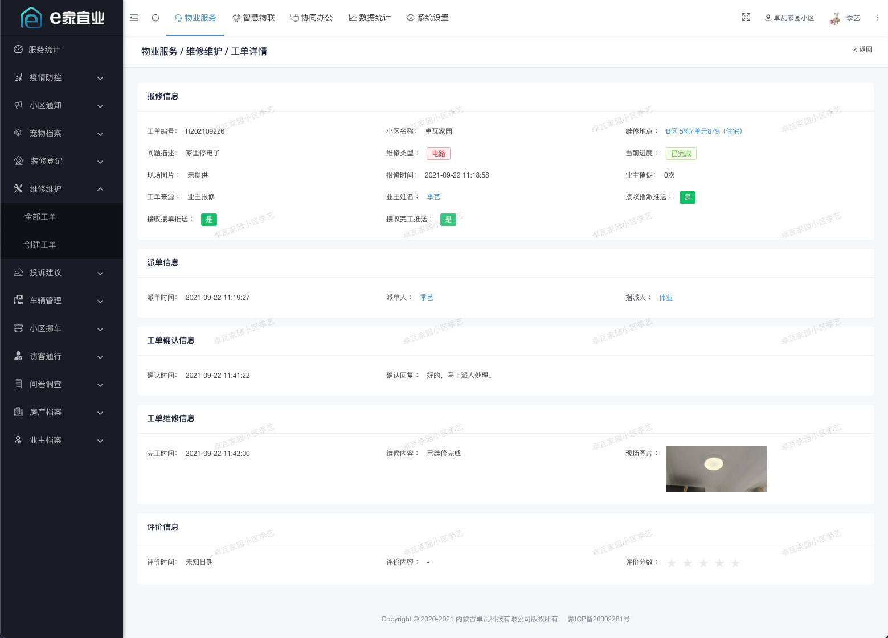
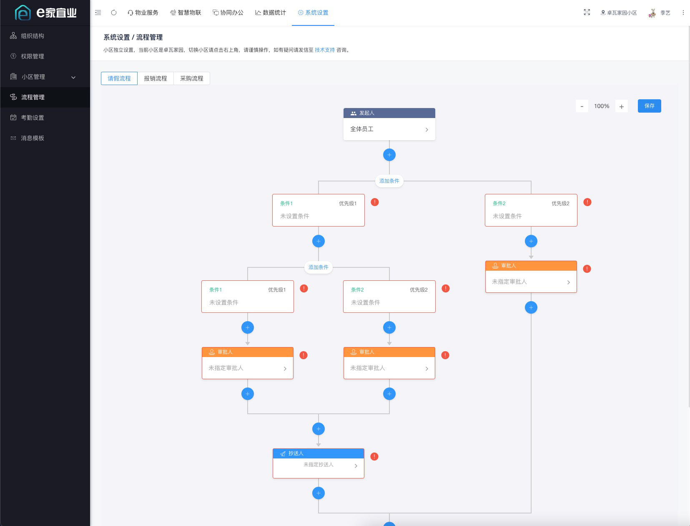
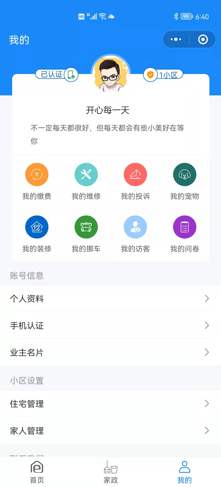
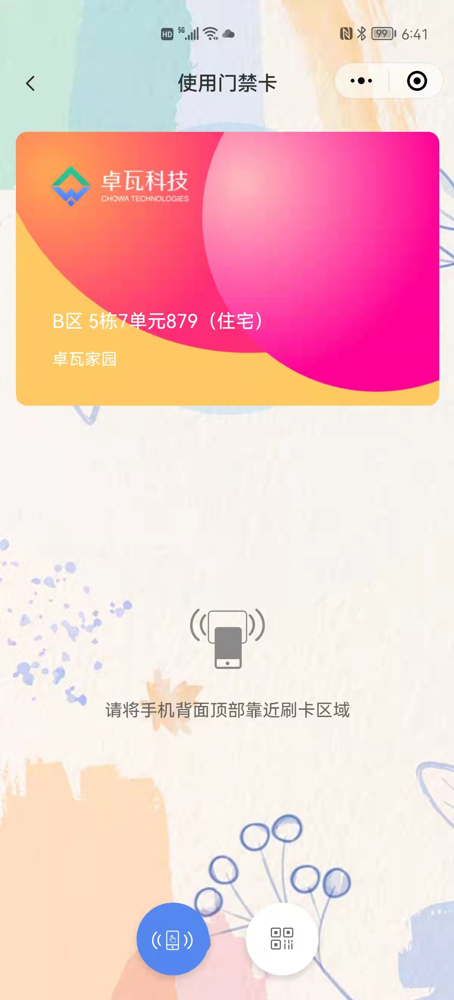
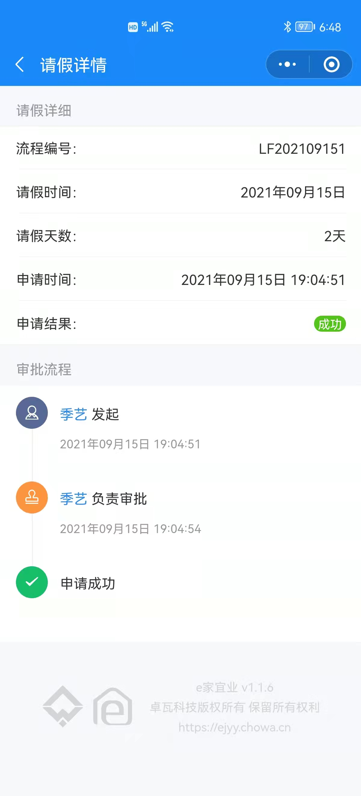
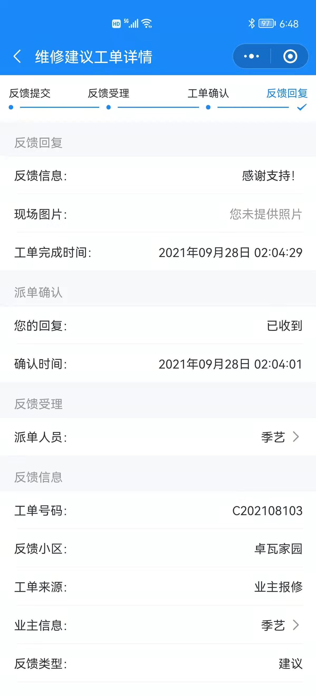

## 项目介绍

「e家宜业」是一套基于AGPL v3开源协议开源的智慧物业解决方案。实现了微信公众号、小程序、PC、H5、智能硬件多端打通。 后端采用Koa + Typescript轻量级构建，支持分布式部署；前端使用vue + view-design开发。

> 禁止将本项目的代码和资源进行任何形式的出售和盈利，产生的一切后果由侵权者自负！！

## 产品展示

### web中台

### 业主端小程序

### 员工端小程序

## 如何部署

[查看文档](https://gj4h0z80f2.feishu.cn/docx/H62ndDuUhodT7dx0QIJc1sMFnfc)

## SASS版及定制

> 微信添加好友请备注来意，谢谢。

## License

